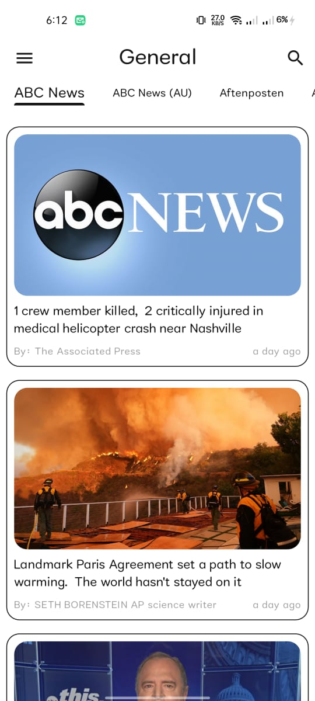

## Frameworks & Languages 


# 📰 News App

<p align="center">
  
</p>

## Description
A simple **News App** built with **Flutter**, using modern packages and clean architecture concepts.  
It fetches live news from a **REST API**, displays them in multiple categories, and allows users to read full articles using an integrated web view.

---

## 🚀 Getting Started

### 📦 Dependencies

This project uses the following main packages:

- [cupertino_icons](https://pub.dev/packages/cupertino_icons) – iOS style icons  
- [http](https://pub.dev/packages/http) – Simple HTTP client for REST APIs  
- [dio](https://pub.dev/packages/dio) – Powerful HTTP client with interceptors  
- [provider](https://pub.dev/packages/provider) – State management solution  
- [flutter_bloc](https://pub.dev/packages/flutter_bloc) – Advanced state management using BLoC pattern  
- [cached_network_image](https://pub.dev/packages/cached_network_image) – Caches and displays images from the internet efficiently  
- [timeago](https://pub.dev/packages/timeago) – Displays human-readable time differences (e.g., “5 minutes ago”)  
- [webview_flutter](https://pub.dev/packages/webview_flutter) – Opens full articles within the app  
- [url_launcher](https://pub.dev/packages/url_launcher) – Opens URLs in external browsers  

---

### 🛠 Dev Dependencies
- [flutter_test](https://pub.dev/packages/flutter_test) – Testing framework for Flutter  
- [flutter_lints](https://pub.dev/packages/flutter_lints) – Recommended lint rules for Flutter projects  

---

### 💻 Installation

Run these commands in your terminal:

#### 1️⃣ Clone the Repository
```bash
git clone https://github.com/omarameen77/News.git
```
#### 2. Cd Over
```bash
cd news
```
#### 3 .Run Pub
```bash
flutter pub get
```
## Help

This app fetches live news articles from a public API using packages like http and dio.
Data is managed using Provider and ensuring smooth UI updates and performance.
If API requests fail, check your internet connection or the API endpoint in your project’s configuration.

## Authors

```bash
Omar Ameen
```
## Images


<p align="left">
  
  
  
  
  
</p>
<p align="left">
  
  
</p>
